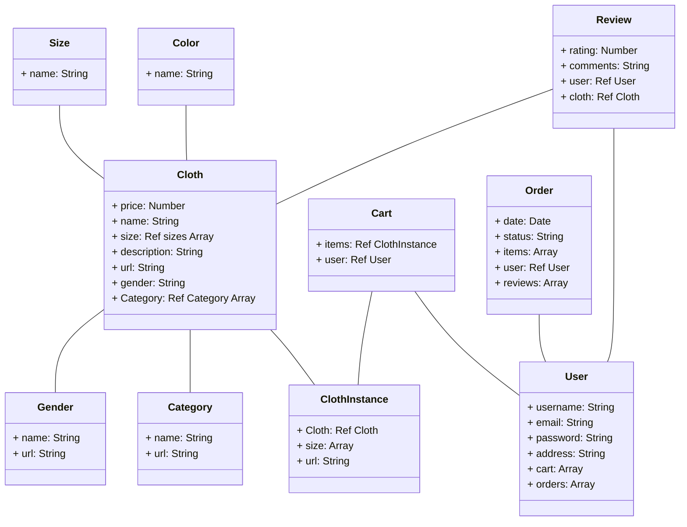

- If populating database by seed-scripts, the change should be incremental so something doesn't break easily.
- To access variables pass from express.js to script tag in ejs files, one needs to use `<%- JSON.stringify() %>`.
- Because the need to use `JSON.stringify()` in the script tag, virtual property defined in the schema/model will be discarded, in the schema/model file, we need to make the following change.
```js
const mongoose = require("mongoose");

const Schema = mongoose.Schema;

const ClothSchema = new Schema({
    name: { type: String, required: true, unique: true },
    price: { type: Number, required: true },
    description: { type: String, required: true },
    gender: { type: String, required: true },
    imageURL: { type: String, required: true },
    category: { type: mongoose.Schema.Types.ObjectId, ref: 'Category', required: true },
  });

ClothSchema.virtual("url").get(function() {
    return `/inventory/cloth/${this._id}`;
})

ClothSchema.set('toJSON', { virtuals: true }); // Add this line

module.exports = mongoose.model("Cloth", ClothSchema);
```

## Fashion ecommerce database diagram
