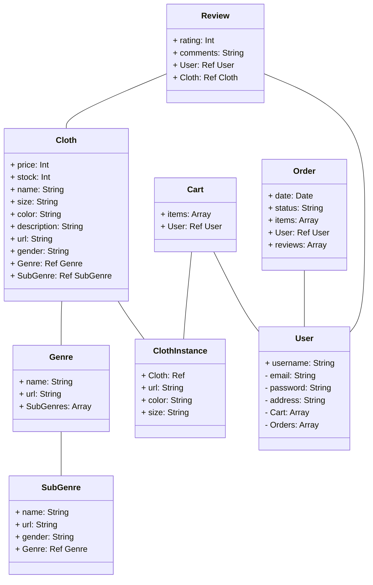

## Fashion ecommerce database diagram

```mermaid
classDiagram
    Cloth -- ClothInstance
    Cloth -- Genre
    Genre -- SubGenre
    Cart -- User
    Order -- User
    Review -- User
    Review -- Cloth
    Cart -- ClothInstance

    class Cloth {
        + price: Int
        + stock: Int
        + name: String
        + size: String
        + color: String
        + description: String
        + url: String
        + gender: String
        + Genre: Ref Genre
        + SubGenre: Ref SubGenre
    }

    class ClothInstance {
        + Cloth: Ref
        + url: String
        + color: String
        + size: String
    }

    class Genre {
        + name: String
        + url: String
        + SubGenres: Array<Ref SubGenre>
    }

    class SubGenre {
        + name: String
        + url: String
        + gender: String
        + Genre: Ref Genre
    }

    class User {
        + username: String
        - email: String
        - password: String
        - address: String
        - Cart: Array<Ref Cart>
        - Orders: Array<Ref Order>
    }

    class Order {
        + date: Date
        + status: String
        + items: Array<Ref ClothInstance>
        + User: Ref User
        + reviews: Array<Ref Review>
    }

    class Review {
        + rating: Int
        + comments: String
        + User: Ref User
        + Cloth: Ref Cloth
    }

    class Cart {
        + items: Array<Ref ClothInstance>
        + User: Ref User
    }


```