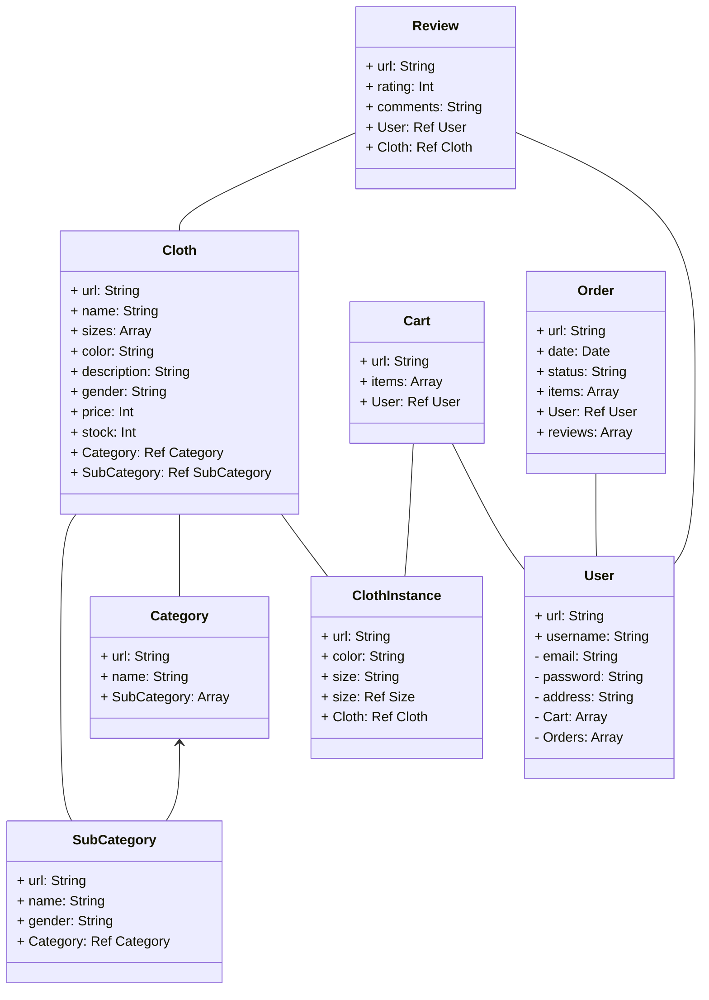

## Fashion ecommerce database diagram

```mermaid
classDiagram
    Cloth -- ClothInstance
    Cloth -- Category
    Cloth -- SubCategory
    Category <-- SubCategory
    Cart -- User
    Order -- User
    Review -- User
    Review -- Cloth
    Cart -- ClothInstance

    class Cloth {
        + url: String
        + name: String
        + sizes: Array<Ref Size>
        + color: String
        + description: String
        + gender: String
        + price: Int
        + stock: Int
        + Category: Ref Category
        + SubCategory: Ref SubCategory
    }

    class ClothInstance {
        + url: String
        + color: String
        + size: String
        + size: Ref Size
        + Cloth: Ref Cloth
    }

    class Category {
        + url: String
        + name: String
        + SubCategory: Array<Ref SubCategory>
    }

    class SubCategory {
        + url: String
        + name: String
        + gender: String
        + Category: Ref Category
    }

    class User {
        + url: String
        + username: String
        - email: String
        - password: String
        - address: String
        - Cart: Array<Ref Cart>
        - Orders: Array<Ref Order>
    }

    class Order {
        + url: String
        + date: Date
        + status: String
        + items: Array<Ref ClothInstance>
        + User: Ref User
        + reviews: Array<Ref Review>
    }

    class Review {
        + url: String
        + rating: Int
        + comments: String
        + User: Ref User
        + Cloth: Ref Cloth
    }

    class Cart {
        + url: String
        + items: Array<Ref ClothInstance>
        + User: Ref User
    }

```