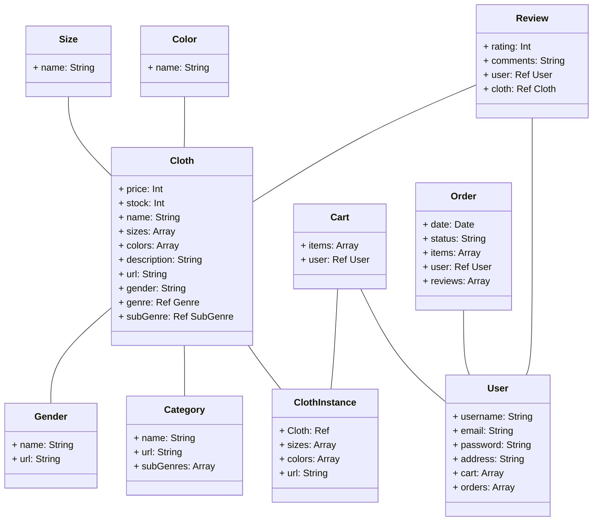

## Fashion ecommerce database diagram

```mermaid
classDiagram
    Cloth -- ClothInstance
    Cloth -- Category
    Cloth -- Gender
    Size -- Cloth
    Color -- Cloth
    Cart -- User
    Order -- User
    Review -- User
    Review -- Cloth
    Cart -- ClothInstance

    class Cloth {
        + price: Int
        + stock: Int
        + name: String
        + sizes: Array<String>
        + colors: Array<String>
        + description: String
        + url: String
        + gender: String
        + genre: Ref Genre
        + subGenre: Ref SubGenre
    }

    class ClothInstance {
        + Cloth: Ref
        + sizes: Array<String>
        + colors: Array<String>
        + url: String
    }

    class Category {
        + name: String
        + url: String
        + subGenres: Array<Ref SubGenre>
    }

    class Gender {
        + name: String
        + url: String
    }

    class Size {
        + name: String
    }

    class Color {
        + name: String
    }

    class User {
        + username: String
        + email: String
        + password: String
        + address: String
        + cart: Array<Ref Cart>
        + orders: Array<Ref Order>
    }

    class Order {
        + date: Date
        + status: String
        + items: Array<Ref ClothInstance>
        + user: Ref User
        + reviews: Array<Ref Review>
    }

    class Review {
        + rating: Int
        + comments: String
        + user: Ref User
        + cloth: Ref Cloth
    }

    class Cart {
        + items: Array<Ref ClothInstance>
        + user: Ref User
    }

```